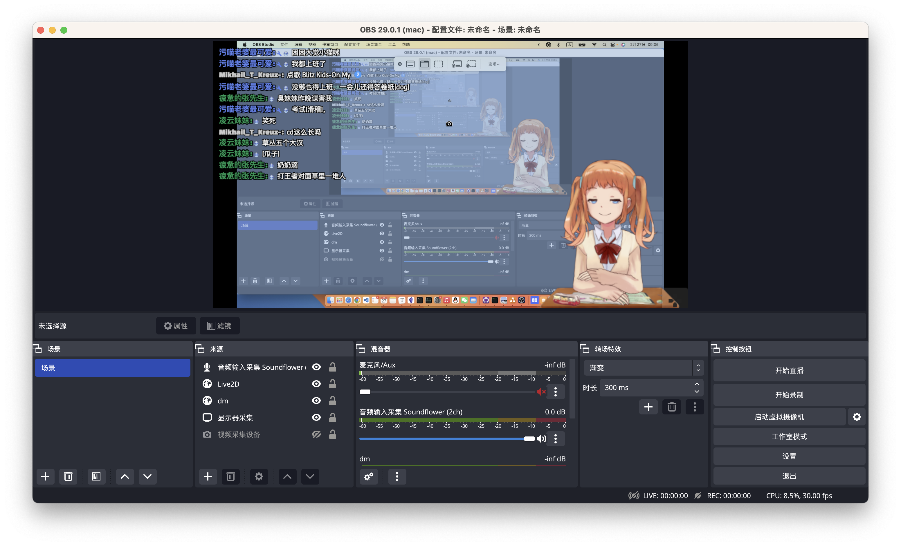

# muvtuber

Makes your AI vtuber.

> 让 AI 成为虚拟主播：看懂弹幕，妙语连珠，悲欢形于色，以一种简单的实现



- 不定期的测试直播：http://live.bilibili.com/26949229
- 介绍文章：[知乎 - 写个AI虚拟主播：看懂弹幕，妙语连珠，悲欢形于色，以一种简单的实现](https://zhuanlan.zhihu.com/p/609878670)

## 项目构成


| 服务                                                         | 说明                                                         | 基于                                                         |
| ------------------------------------------------------------ | ------------------------------------------------------------ | ------------------------------------------------------------ |
| [blivechat](https://github.com/cdfmlr/blivechat/tree/muvtuber) | 获取直播间弹幕消息。                                         | [xfgryujk/blivechat](https://github.com/xfgryujk/blivechat) 做的非常好，直接用了，没有额外封装。 |
| [Live2dView](https://github.com/cdfmlr/live2dview)           | 前端：显示 [Live2D](https://www.live2d.com/en/) 模型         | [guansss/pixi-live2d-display](https://github.com/guansss/pixi-live2d-display) |
| [Live2dDriver](https://github.com/cdfmlr/live2ddriver)       | 驱动前端 Live2D 模型动作表情                                 | -                                                            |
| [ChatGPTChatbot](https://github.com/cdfmlr/chatgpt_chatbot)  | 基于 [ChatGPT](https://chat.openai.com) 的优质聊天机器人     | [acheong08/ChatGPT](https://github.com/acheong08/ChatGPT)    |
| [MusharingChatbot](https://github.com/cdfmlr/musharing_chatbot) | 基于 [ChatterBot](https://github.com/gunthercox/ChatterBot) 的简单聊天机 | [RaSan147/ChatterBot_update](https://github.com/RaSan147/ChatterBot_update) <br/> [musharing-team/chatbot_api](https://github.com/musharing-team/chatbot_api) |
| [Emotext](https://github.com/cdfmlr/emotext)                 | 中文文本情感分析                                             | [cdfmlr/murecom-verse-1](https://github.com/cdfmlr/murecom-verse-1) |
| [muvtuberdriver](https://github.com/cdfmlr/muvtuberdriver)   | 组装各模块，驱动整个流程                                     | -                                                            |
| [muvtuber-proto](https://github.com/cdfmlr/muvtuber-proto)   | proto 定义                                                   |                                                              |

## 起步

（首次使用，毋必按照如下步骤走一边，不能直接看后面的部署一节）

 -1. 开发环境：

```sh
$ uname -mrs
Darwin 22.3.0 arm64
# 目前 TTS 模块还依赖于 macOS，其他系统可能不行。
$ go version  
go version go1.20.1 darwin/arm64
$ python3 --version
Python 3.9.16  # blivechat
Python 3.10.10 # others
$ poetry --version
Poetry (version 1.4.0)
$ node --version
v18.14.2
$ pyenv --version
pyenv 2.3.14
$ pnpm --version
7.29.0
```

Node.js 和 Python 的包管理配置：

```sh
# 前端统一使用 pnpm (珍爱硬盘，远离 npm)
pnpm config set auto-install-peers true -g
# python统一使用 pyenv + poetry
poetry config virtualenvs.prefer-active-python true
poetry config virtualenvs.in-project true  # 只是个人的保守偏好
```

0. 现在可用 git submodule 一次性拉取整个项目，无需手动 clone 各个模块了:

```sh
git clone --recursive https://github.com/cdfmlr/muvtuber.git
```

接下来编译运行各个模块（Docker 仍不可用，需手动做散装服务编排）可以预先开 7 个终端页，然后：

1. [blivechat](https://github.com/cdfmlr/blivechat/tree/muvtuber)

```sh
cd blivechat

# 编译前端
cd frontend
pnpm install
pnpm run build
cd ..

# 运行服务
pyenv local 3.9.16
poetry install
poetry run python main.py
# 服务运行在 http://localhost:12450，会自动在默认浏览器打开
```

2. [Emotext](https://github.com/cdfmlr/emotext)

```sh
cd emotext

pyenv local 3.10.10
poetry install
poetry run python emotext/httpapi.py --port 9003
# emotext server: http://localhost:9003
```

3. [ChatGPTChatbot](https://github.com/cdfmlr/chatgpt_chatbot)

```sh
cd chatgpt_chatbot

pyenv local 3.10.10
poetry install
poetry run python chatgpt
# ChatGPTChatbot gRPC server: localhost:50052
```

4. [MusharingChatbot](https://github.com/cdfmlr/musharing_chatbot)

```sh
cd musharing_chatbot

pyenv local 3.10.10
poetry install
poetry run python -m spacy download en_core_web_sm  # 一个执行不到的依赖，但是不装跑不起来。
PYTHONPATH=$PYTHONPATH:. poetry run python musharing_chatbot
# MusharingChatbot gRPC server: localhost:50051
```


5. [Live2dDriver](https://github.com/cdfmlr/live2ddriver)

```sh
#git clone https://github.com/cdfmlr/live2ddriver.git
cd live2ddriver

go run . -shizuku localhost:9004 -verbose
# live2d shizuku driver: localhost:9004
# websocket message forwarder: localhost:9001 # 前端会连这个

# 不开发该模块也可以 build 出来再运行
```

6. [Live2dView](https://github.com/cdfmlr/live2dview)

```sh
#git clone https://github.com/cdfmlr/live2dview.git
cd live2dview

pnpm install
pnpm exec quasar dev
# 浏览器访问: 调试(戏)页: http://localhost:9000/#/debug
# 生产环境: OBS 添加浏览器源: http://localhost:9000/

# 如果不开发这个模块可以 build & serve:
pnpm exec quasar build
httpstatic -d dist/spa/ -l :9000  # 你的某种静态网页服务工具，如 python -m http.server，如果开发环境最好有宽松的 CROS。这里用的是 https://github.com/cdfmlr/tools/#httpstatic
```

7. [muvtuberdriver](https://github.com/cdfmlr/muvtuberdriver)

muvtuberdriver 必须在前面所有服务正确启动后才能启动，否则会 panic 退出。

```sh
#git clone https://github.com/cdfmlr/muvtuberdriver.git
cd muvtuberdriver

go run . -chatgpt_access_token='eyJ***99A' -chatgpt_prompt="请扮演一个正在直播的 vtuber，之后我的输入均为用户评论，用简短的一句话回答它们" -roomid 000000 -reduce_duration=2s
# chatgpt_access_token: 浏览器访问https://chat.openai.com/api/auth/session获取
# roomid 你的 b 站直播间 id，https://live.bilibili.com/000000?... 中的000000

# 不开发该模块也可以 build 出来再运行
```

8. OBS

```sh
brew install obs
# 或：https://obsproject.com

# 启动 OBS，设置：
# - blivechat 的弹幕框：localhost:12450/...
# - Live2DView：localhost:9000
# - 音频（say）的输出：你使用的音频设备
# 【开始直播】
```

给新手的 OBS 配置详解：

- Live2DView：来源 > `+` > 浏览器 > 新建 > URL: http://localhost:9000/#/
- blivechat：来源 > `+` > 浏览器 > 新建 > URL: 
  - 先用浏览器打开 http://localhost:12450
  - 首页 > 房间号：设置为你的房间号 > 进入房间
  - 弹出的窗口 -> 拷贝地址
  - 粘贴到 OBS 的 URL
- 音频：来源 > `+` >音频输入采集 > 新建 > 设备：BlackHole 2ch
  - 要先安装一个 [BlackHole](https://github.com/ExistentialAudio/BlackHole)。（但测试了一下感觉 BlackHole 音质似乎有的怪？还是 soundflower 香啊，但太难了）
  - 在开始直播前，控制中心 > 声音> 右边 AirPlay 图标 > 选 BlackHole。
  - 然后电脑输出的声音就会 -> BlackHole -> OBS。
- B 站推流：设置（Preferences）> 直播 > 服务：选 `Bilibili Live ...`，推流码填「B 站首页 > 头像 > 推荐服务 > 直播中心 > 左侧“我的直播间”> 填好直播分类、房间标题 > 开始直播，然后会显示的串流密钥」

## 部署

（首次使用，毋必按照前面步骤走一边，不能直接用下面的）

按照上面步骤走过一次之后就可以比较方便地再启动了：

```sh
cd blivechat; nohup poetry run python main.py >> ../run-muvtuber.log 2>&1 &; cd ..
cd emotext; nohup poetry run python emotext/httpapi.py --port 9003 >> ../run-muvtuber.log 2>&1  &; cd ..
cd chatgpt_chatbot; nohup poetry run python chatgpt >> ../run-muvtuber.log 2>&1 &; cd ..
cd musharing_chatbot; PYTHONPATH=$PYTHONPATH:. nohup poetry run python musharing_chatbot >> ../run-muvtuber.log 2>&1  &; cd ..
cd live2ddriver; nohup go run . -shizuku localhost:9004 -verbose >> ../run-muvtuber.log 2>&1 &; cd ..
# alias httpstatic="~/tools/httpstatic/bin/httpstatic"
cd live2dview; nohup httpstatic -d dist/spa/ -l :9000 >> ../run-muvtuber.log 2>&1 &; cd ..
cd muvtuberdriver; nohup go run . -chatgpt_access_token='eyJ***99A' -chatgpt_prompt="请扮演一个正在直播的 vtuber，之后我的输入均为用户评论，用简短的一句话回答它们" -roomid 000000 -reduce_duration=2s >> ../run-muvtuber.log 2>&1 &; cd ..
# 然后就是开 OBS，推流开播了。
```

懒得写 Makefile 或者 sh 脚本了。总之先这样凑合一下吧。之后还要重构成 Docker 的，到时候再一起加 make。

## TODO

- [ ] 文档：各项目的 README、文档
- [ ] Topic：直播话题：一起看，打游戏，互动游戏，……
- [ ] murecom for muvtuber：基于心情的 BGM
- [ ] Live2D View & Driver：焦点控制、像官方的 Viewer 那样丰富的任意动作、表情控制（离散 -> 连续）
- [ ] Chatbot：
  - [ ] ChatGPT 平替
  - [x] ChatGPT 多用户轮流访问：提高可用性
  - [ ] MusharingChatbot（ChatterBot）重新训练
- [ ] Sayer（TTS）：不依赖于 macOS 的平替
- [ ] 工程化：
  - [ ] 全部内部接口 => gRPC
  - [ ] 散装微服务 => 容器编排
- [ ] 一个 muvtuber 出道介绍视频：匿名 m
- [ ] Filter：优先 + 排队，不要直接扔，存着，词穷的时候别冷场
- [ ] ……

## 开放源代码

所有下属项目除非特别说明，一律在 MIT 协议下开放源代码。

欢迎任何有关 Issue 问题、PR 贡献以及讨论。


